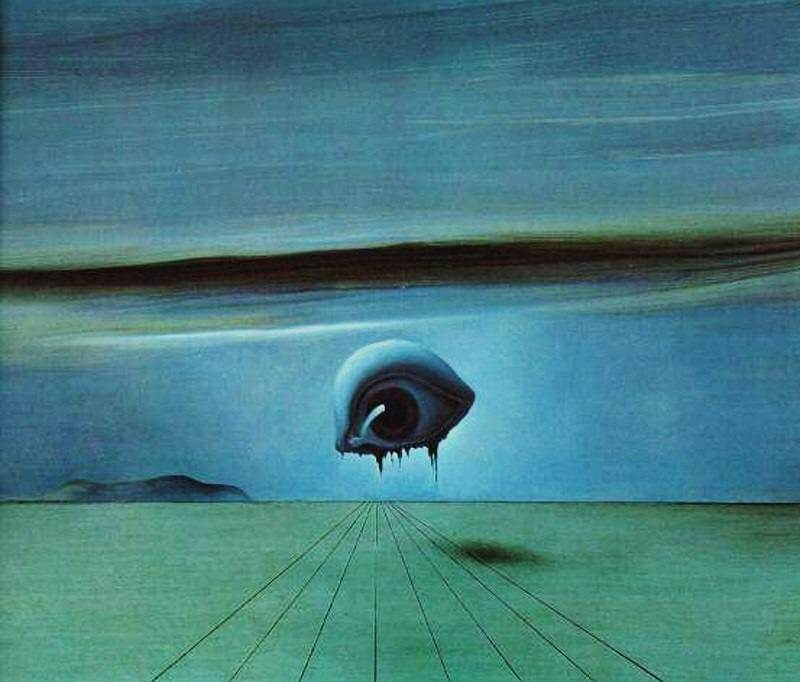

<!DOCTYPE html>
<html lang="en">
<head>
  <meta charset="UTF-8">
</head>
<body>

  <div id="header">

  <h1>🔍🕵🧐 INTEL 🧐🕵🔎</h1>

  <blockquote>
  <h3>"Even if you're not doing anything wrong, you are being watched and recorded. And the storage capability of these systems increases every year, consistently by orders of magnitude. You don’t have to have done anything wrong, you simply have to fall under suspicion." (Edward Snowden)</h3></blockquote>

  <p align="center"></p>

  </div>

  <hr>
  <!-- ################################################# -->

```
geojson { "type": "FeatureCollection", "features": [ { "type": "Feature","id": 1, "properties": { "ID": 0, "Name": "NSA Headquarters" }, "geometry": { "type": "Polygon", "coordinates": [ [ [-76.77255, 39.10559], [-76.77255, 39.11029], [-76.76675, 39.11029], [-76.76675, 39.10559], [-76.77255, 39.10559] ] ] } } ] }
 ```
  
  <hr>
  <!-- ################################################# -->

  👷🛠️UNDER CONSTRUCTION🚧🏗
  <br>

  <details>
  <summary>INTEL</summary>
  <br>

  <h4>Intel References</h4>
  
  <ul>
  <li><a href="https://theintercept.com">The Intercept</a></li>
  <li><a href="https://wikileaks.org">WikiLeaks</a></li>
  <li><a href="https://publicintelligence.net">Public Intelligence</a></li>
  <li><a href="https://ddosecrets.com/wiki/Distributed_Denial_of_Secrets">DDoSecrets</a></li>
  <li><a href="https://cryptome.org">Cryptome</a></li>
  <li><a href="https://unredacted.com" target="_blank" rel="noopener noreferrer">Unredacted</a></li>
  <li><a href="https://cognitive-liberty.online" target="_blank" rel="noopener noreferrer">Cognitive Liberty</a></li>
  <li><a href="https://paybackpolitics.weebly.com" target="_blank" rel="noopener noreferrer">Payback Politics</a></li>
  </ul>

  </details>

  <!-- ################################################# -->

  👷🛠️UNDER CONSTRUCTION🚧🏗<br>

  <details>
  <summary>OSINT</summary>

  <h4>OSINT Resources</h4>
    <li><strong><a href="https://github.com/jivoi/awesome-osint" target="_blank" rel="noopener noreferrer">Awesome OSINT</a></strong></li>
    <li><strong><a href="https://github.com/sherlock-project/sherlock" target="_blank" rel="noopener noreferrer">Sherlock Project</a></strong></li>
    <li><a href="https://breachdirectory.org" target="_blank" rel="noopener noreferrer">Breach Directory</a></li>
    <li><a href="https://md5decrypt.net/en/Sha1" target="_blank" rel="noopener noreferrer">MD5 Decrypt</a></li>
    <li><a href="https://namechk.com" target="_blank" rel="noopener noreferrer">Name OSINT</a></li>
    <li><a href="https://iplogger.org" target="_blank" rel="noopener noreferrer">IP Logger</a></li>
    <li><a href="https://iplogger.org/ip-tracker" target="_blank" rel="noopener noreferrer">IP Tracker</a></li>
    <li><a href="https://iplogger.org/location-tracker" target="_blank" rel="noopener noreferrer">Location Tracker</a></li>
    <li><a href="https://iplogger.org/url_checker" target="_blank" rel="noopener noreferrer">URL Checker</a></li>
    <li><a href="https://iplogger.org/mac-checker" target="_blank" rel="noopener noreferrer">MAC Address Lookup</a></li>
    <li><a href="https://mha.azurewebsites.net" target="_blank" rel="noopener noreferrer">Message Header Analyzer (Online)</a></li>
    <li><a href="https://github.com/microsoft/MHA" target="_blank" rel="noopener noreferrer">Message Header Analyzer (GitHub)</a></li>
    <li><a href="https://hashes.com/en/decrypt/hash" target="_blank" rel="noopener noreferrer">Rainbow Tables (Hashes)</a></li>
    <li><a href="https://en.wikipedia.org/wiki/Magic_number_(programming)" target="_blank" rel="noopener noreferrer">Magic Numbers</a></li>
    <li><a href="https://www.blocksherlock.com/home/blockchain-explorers" target="_blank" rel="noopener noreferrer">Blockchain Sherlock</a></li>
    <li><a href="https://archive.org" target="_blank" rel="noopener noreferrer">Web Cache</a></li>
  </ul>

  <h4>Google Search Operators</h4>
  
  <ul>
    <li><strong>Sinal (“ ”):</strong> Search for an Exact Term</li>
    <li><strong>Sign (+):</strong> Search for Two Terms</li>
    <li><strong>Sinal (-):</strong> Exclusion of a Certain Term</li>
    <li><strong>Sinal (*):</strong> Acceptance of Key Term/Wildcard</li>
    <li><strong>OR Sign:</strong> Acceptance of One or the Other</li>
    <li><strong>Site:</strong> Exclusive Search on a Certain Site</li>
    <li><strong>Inurl:</strong> Search for Words in the URL</li>
    <li><strong>Intitle:</strong> Search for Words in the Site Title</li>
    <li><strong>Filetype:</strong> Search for a Specific File Type</li>
    <li><strong>Related:</strong> Search for Pages Similar to a URL</li>
    <li><strong>Info:</strong> Search for Information on a Site</li>
    <li><strong>Cache:</strong> Search for Cached Information on a Site</li>
  </ul>

  <h4>Google Advanced Search Resources</h4>
  <ul>
  <li><a href="https://www.googleguide.com/advanced_operators_reference.html" target="_blank" rel="noopener noreferrer">Google Guide Advanced Operator Quick Reference</a></li>
  <li><a href="https://en.wikisource.org/wiki/Untangling_the_Web" target="_blank" rel="noopener noreferrer">NSA Lessons - Untangling the Web</a></li>
  <li><a href="https://www.governmentattic.org/documentsDoDLogs.html" target="_blank" rel="noopener noreferrer">Department of Defense (DoD) FOIA/MDR Logs</a></li>
  <li><a href="https://developers.google.com/search/docs/crawling-indexing/ask-google-to-recrawl" target="_blank" rel="noopener noreferrer">Google Alerts and Google News</a></li>
  </ul>

  <h3>Reverse Image Search</h3>
  <ul>
  <li><a href="https://www.tineye.com/" target="_blank" rel="noopener noreferrer">TinEye Reverse Image Search</a></li>
  <li><a href="https://www.google.com/imghp" target="_blank" rel="noopener noreferrer">Google Images</a></li>
  <li><a href="http://exif.regex.info/exif.cgi" target="_blank" rel="noopener noreferrer">Jeffrey Friedl's Image Metadata Viewer</a></li>
  <li><a href="https://artsexperiments.withgoogle.com/artpalette/" target="_blank" rel="noopener noreferrer">Google Art & Culture Experiment - Art Palette</a></li>
  <li><a href="https://yandex.com/images/" target="_blank" rel="noopener noreferrer">Yandex Images</a></li>
  <li><a href="https://www.aliseeks.com/search" target="_blank" rel="noopener noreferrer">Aliseeks</a></li>
  <li><a href="https://www.labnol.org/reverse/" target="_blank" rel="noopener noreferrer">Google Reverse Image Search for Mobile</a></li>
  </ul>

  <h3>Web Snapshots</h3>
  <ul>
  <li><a href="https://archive.org/" target="_blank" rel="noopener noreferrer">Internet Archive</a></li>
  <li><a href="http://cachedview.com/" target="_blank" rel="noopener noreferrer">CachedView</a></li>
  <li><a href="https://pagecached.com/" target="_blank" rel="noopener noreferrer">Page Cached</a></li>
  <li><a href="https://cache.nevkontakte.com/#!/" target="_blank" rel="noopener noreferrer">Google Cache Browser 3.0</a></li>
  <li><a href="https://cachearchive.com/" target="_blank" rel="noopener noreferrer">Cached Websites Check from Google Webcache and Archive.org</a></li>
  <li><a href="https://arquivo.pt/?l=pt" target="_blank" rel="noopener noreferrer">Arquivo.pt: Search Past Pages</a></li>
  </ul>

  <h3>Package Information</h3>
  <ul>
  <li><a href="https://www.17track.net" target="_blank" rel="noopener noreferrer">17Track</a></li>
  <li><a href="http://www.kuaidi100.com/" target="_blank" rel="noopener noreferrer">快递100 (Express 100)</a></li>
  <li><a href="http://www.spb.gov.cn/yzbmcx/" target="_blank" rel="noopener noreferrer">China State Post Bureau</a></li>
  <li><a href="http://www.ckd.cn/" target="_blank" rel="noopener noreferrer">快递查询 (Express Inquiry)</a></li>
  </ul>
  
  <h3>Car Information</h3>
  <ul>
  <li><a href="https://www.nicb.org/vincheck" target="_blank" rel="noopener noreferrer">VINCheck® - National Insurance Crime Bureau</a></li>
  <li><a href="https://www.nomerogram.ru/" target="_blank" rel="noopener noreferrer">Nomerogram - Vehicle License Plate Lookup</a></li>
  </ul>

  <h4>Vehicle Identification Number Code</h4>
  <ul>
  <li><a href="https://carsowners.net/" target="_blank" rel="noopener noreferrer">Free VIN Code Search Service</a></li>
  <li><a href="https://www.faxvin.com/" target="_blank" rel="noopener noreferrer">Vehicle History Reports</a></li>
  <li><a href="http://www.17vin.com/" target="_blank" rel="noopener noreferrer">17VIN - VIN Code Lookup</a></li>
  <li><a href="https://www.vehiclehistory.com/" target="_blank" rel="noopener noreferrer">Vehicle History - VIN Lookup</a></li>
  <li><a href="https://www.carfax.com/" target="_blank" rel="noopener noreferrer">CARFAX - Vehicle History Reports</a></li>
  <li><a href="https://www.autocheck.com/" target="_blank" rel="noopener noreferrer">AutoCheck - Vehicle History Reports</a></li>
  <li><a href="https://www.vinaudit.com/" target="_blank" rel="noopener noreferrer">VIN Audit - Vehicle History Reports</a></li>
  <li><a href="https://www.nmvtis.gov/" target="_blank" rel="noopener noreferrer">NMVTIS - National Motor Vehicle Title Information System</a></li>
  <li><a href="https://www.revscheck.com.au/" target="_blank" rel="noopener noreferrer">REVS Check - Australia Vehicle History Reports</a></li>
  <li><a href="https://www.cochea.com/" target="_blank" rel="noopener noreferrer">Cochea - Vehicle Information (Latin America)</a></li>
  <li><a href="https://www.autoscout24.com/" target="_blank" rel="noopener noreferrer">AutoScout24 - Vehicle Listings and Information</a></li>
  <li><a href="https://www.autotrader.com/" target="_blank" rel="noopener noreferrer">AutoTrader - Vehicle Listings and History</a></li>
  <li><a href="https://www.motor1.com/vehicle-history/" target="_blank" rel="noopener noreferrer">Motor1 - Vehicle History Reports</a></li>
  <li><a href="https://www.cars.com/vehicle-history/" target="_blank" rel="noopener noreferrer">Cars.com - Vehicle History Reports</a></li>
  <li><a href="https://www.checkvin.com/" target="_blank" rel="noopener noreferrer">CheckVIN - VIN Lookup and Vehicle History</a></li>
  <li><a href="https://www.vincarhistory.com/" target="_blank" rel="noopener noreferrer">VIN Car History - Vehicle History Reports</a></li>
  <li><a href="https://www.vincheckup.com/" target="_blank" rel="noopener noreferrer">VIN Checkup - Vehicle History Reports</a></li>
  <li><a href="https://www.trucar.com/" target="_blank" rel="noopener noreferrer">Trucar - Vehicle History and Pricing</a></li>
  <li><a href="https://www.vehicleidentificationnumber.com/" target="_blank" rel="noopener noreferrer">Vehicle Identification Number - VIN Lookup</a></li>
  <li><a href="https://www.vin-info.com/" target="_blank" rel="noopener noreferrer">VIN-Info - Vehicle Information and History</a></li>
  <li><a href="http://www.yiparts.com/vin" target="_blank" rel="noopener noreferrer">宜配网 VIN查询 (Yiparts VIN Lookup)</a></li>
  <li><a href="http://www.fenco.cn/" target="_blank" rel="noopener noreferrer">奉新行 VIN查询 (Fengxin VIN Lookup)</a></li>
  <li><a href="http://www.chexinhui.com/pcIndexAction.action?method=showHelpUI&id=16725&typeId=303" target="_blank" rel="noopener noreferrer">车信会 VIN查询 (Chexinhui VIN Lookup)</a></li>
  <li><a href="http://www.vin114.net/" target="_blank" rel="noopener noreferrer">力洋汽车信息查询 (Liyang Auto Information)</a></li>
  <li><a href="http://www.chinacar.com.cn/vin_index.html" target="_blank" rel="noopener noreferrer">中国汽车网 - VIN查询 (China Car VIN Lookup)</a></li>
  <li><a href="https://www.sopei.cn/" target="_blank" rel="noopener noreferrer">搜配网 - VIN码识别 (Sopei VIN Lookup)</a></li>
  <li><a href="https://www.juhe.cn/docs/api/id/283?" target="_blank" rel="noopener noreferrer">聚合数据 - VIN码查询 (Juhe VIN API)</a></li>
  <li><a href="https://www.jisuapi.com/api/vin/" target="_blank" rel="noopener noreferrer">极速数据 - VIN车辆识别代码查询 (Jisu API VIN Lookup)</a></li>
  <li><a href="https://market.aliyun.com/products/56928004/cmapi013503.html#sku=yuncode750300000" target="_blank" rel="noopener noreferrer">易源数据 - 车架号VIN查询 (Yiyuan VIN API)</a></li>
  </ul>

  <h3>Academic Information</h3>
  <ul>
  <li><a href="https://libgen.pw/" target="_blank" rel="noopener noreferrer">Libgen</a></li>
  <li><a href="https://www.semanticscholar.org/" target="_blank" rel="noopener noreferrer">Semantic Scholar</a></li>
  <li><a href="https://libgen.is/" target="_blank" rel="noopener noreferrer">Library Genesis</a></li>
  <li><a href="https://www.wolframalpha.com/" target="_blank" rel="noopener noreferrer">Wolfram|Alpha</a></li>
  <li><a href="https://search.emarefa.net/en" target="_blank" rel="noopener noreferrer">e-Marefa - The Digital Arabic Database: Studies & Researches</a></li>
  <li><a href="https://eric.ed.gov/" target="_blank" rel="noopener noreferrer">ERIC - Education Resources Information Center</a></li>
  <li><a href="https://www.scinapse.io/" target="_blank" rel="noopener noreferrer">Scinapse - Academic Search Engine for Papers</a></li>
  <li><a href="https://sweetsearch.com/" target="_blank" rel="noopener noreferrer">SweetSearch - A Search Engine for Students</a></li>
  <li><a href="https://core.ac.uk/" target="_blank" rel="noopener noreferrer">CORE - Aggregating the World’s Open Access Research Papers</a></li>
  <li><a href="https://www.base-search.net/" target="_blank" rel="noopener noreferrer">BASE (Bielefeld Academic Search Engine): Basic Search</a></li>
  </ul>

  <h3>ACG (Anime, Comics, Games)</h3>
  <ul>
  <li><a href="https://iqdb.org/" target="_blank" rel="noopener noreferrer">Multi-service Image Search</a></li>
  <li><a href="https://saucenao.com/" target="_blank" rel="noopener noreferrer">SauceNAO Image Search</a></li>
  <li><a href="https://trace.moe/" target="_blank" rel="noopener noreferrer">WAIT: What Anime Is This?</a></li>
  <li><a href="https://ascii2d.net/" target="_blank" rel="noopener noreferrer">ASCII2D - Anime Image Search</a></li>
  </ul>
  
  <h3>Flight and Airplane Information</h3>
  <ul>
  <li><a href="https://www.flightradar24.com/" target="_blank" rel="noopener noreferrer">Flight Tracker | Flightradar24</a></li>
  <li><a href="https://habr.com/en/post/440596/" target="_blank" rel="noopener noreferrer">Flightradar24 - How It Works?</a></li>
  <li><a href="https://zh.flightaware.com/" target="_blank" rel="noopener noreferrer">FlightAware</a></li>
  <li><a href="http://flightadsb.variflight.com/" target="_blank" rel="noopener noreferrer">Flightadsb - Real-Time Flight Tracking</a></li>
  <li><a href="https://direct-flights.com/" target="_blank" rel="noopener noreferrer">Direct Flights - Explore Non-Stop Flights</a></li>
  <li><a href="https://www.radarbox.com" target="_blank" rel="noopener noreferrer">AirNav RadarBox - Live Flight Tracker</a></li>
  <li><a href="https://tar1090.adsbexchange.com/" target="_blank" rel="noopener noreferrer">ADS-B Exchange - Aircraft Tracking</a></li>
  <li><a href="https://www.flightview.com/flighttracker/" target="_blank" rel="noopener noreferrer">FlightView Flight Tracker</a></li>
  <li><a href="http://www.planeflighttracker.com/" target="_blank" rel="noopener noreferrer">Plane Flight Tracker</a></li>
  <li><a href="https://www.flightstats.com/v2" target="_blank" rel="noopener noreferrer">FlightStats - Global Flight Status & Tracker</a></li>
  <li><a href="https://www.ifly.com/flight-tracker" target="_blank" rel="noopener noreferrer">iFly.com - Flight Status</a></li>
  <li><a href="https://registry.faa.gov/aircraftinquiry/Aircraft_Inquiry.aspx" target="_blank" rel="noopener noreferrer">FAA Registry - Aircraft N-Number Inquiry</a></li>
  <li><a href="https://radar.freedar.uk/VirtualRadar/desktop.html" target="_blank" rel="noopener noreferrer">Virtual Radar</a></li>
  </ul>

  # Brazillian OSINT<br>
  
  **OSINT Brazuca - https://github.com/osintbrazuca/osint-brazuca**<br>
  **OSINT Brazuca Regex - https://github.com/osintbrazuca/osint-brazuca-regex**
  
  Pre-paid Cell - https://cadastropre.com.br/#consultation<br>
  Cell Status - https://consultanumero.abrtelecom.com.br/consultanumero/consulta/consultaSituacaoAtualCtg<br>

  <br> 3.2. Veículos / Rodovias 3.2.1. Detran Pará 3.2.2. APP Sinesp Cidadão
  3.2.3. Consulta de Multas da PRF 3.2.4. Consulta de Condições de Rodovias
  3.3. Voos / Aeroportos 3.3.1. Fly Radar 24 3.3.2. Flight Aware 3.4.
  Navegações / Portos 3.4.1. Marine Graffiti 3.4.2. Vessel Fi 3.5. Sistema
  Telefônico 3.5.1. Telebrasil (estações rádio base 3.5.2. Consulta Número
  3.5.3. Qual Operadora? 3.5.4. Portal TP2 Location 3.5.5. Truecaller
  3.5.6. Teleco 3.6. Poder Executivo 3.6.1. Portal da Transparência 3.6.2.
  Painel de Preços 3.6.3. Portal Brasileiro de Dados Abertos 3.6.4. Ipea
  Data 3.6.5. IBGE Data 3.6.6. Portal de Acesso à Informação da CGU 3.6.7.
  Pesquisa de Relatórios da CGU 3.6.8. Painel Monitoramento de Dados
  Abertos da CGU 3.6.9. Painel de Corregedorias da CGU 3.6.10. Secretaria
  do Tesouro Nacional 3.6.11. Banco do Brasil 3.6.12. Licitações-e 3.6.13.
  BNDES 3.6.14. Portal dos Convênios do Governo Federal 3.6.15. Diários
  Oficiais 3.6.16. Programa Bolsa Família 3.6.17. Portal da Transparência
  do Governo do Estado do Pará 3.6.18. Diário Oficial do Governo do Estado
  do Pará 3.6.19. Portal de Consulta da Sefaz do Estado do Pará 3.6.20.
  Portal de Serviços da Sefaz do Estado do Pará 3.6.21. Portal da Transparência
  da Prefeitura de Belém/PA 3.7. Poder Legislativo 3.7.1. Portal da Transparência
  da Câmara dos Deputados 3.7.2. Portal da Transparência do Senado Federal
  3.7.3. Portal da Transparência da Assembleia Legislativa do Pará 3.7.4.
  Portal da Transparência da Câmara Municipal de Belém 3.8. Poder Judiciário,
  Tribunais de Contas e Ministérios Públicos 3.8.1. Portal da Transparência
  do STF 3.8.2. Portal da Transparência do STJ 3.8.3. Portal da Transparência
  do STM 3.8.4. Portal da Transparência do TST 3.8.5. Portal da Transparência
  do TSE 3.8.6. Divulgação de Candidaturas e Contas Eleitorais 3.8.7.
  Portal da Transparência do TJ/PA 3.8.8. Portal da Transparência do
  TCU 3.8.9. Portal da Transparência do TCE/PA 3.8.10. Portal da Transparência
  do TCM/PA 3.8.11. Portal da Transparência do MPF 3.8.12. Portal da
  Transparência do MP/PA 3.9. Certidões 3.9.1. Cadastro de Pessoa Física
  3.9.2. Certidão de Débitos Tributários Federais 3.9.3. Portal Cartório
  de Protestos 3.9.4. Certidão Negativa de Débitos Trabalhistas 3.9.5.
  Certidão Negativa de Débitos da Justiça Militar 3.9.6. Certidão de
  Regularidade da Justiça Eleitoral 3.9.7. Regularidade de Empregador
  3.9.8. Regularidade Perante o TCU 3.10. Sistema de Segurança Pública
  3.10.1. Atlas da Violência 3.10.2. Monitor da Violência 3.10.3. Antecedentes
  Criminais - PF 3.10.4. Antecedentes Criminais - PC/PA 3.10.5. Mandados
  de Prisão 3.11. Sistema de Educação Pública 3.11.1. IBGE Educa 3.11.2.
  Educação Inteligente 3.11.3. Portal Dados Abertos do MEC 3.11.4. Portal
  Dados Abertos do INEP 3.11.5. Consulta de Liberações de Recursos do
  FNDE 3.11.6. Conselho de Acompanhamento e Controle Social do FUNDEB
  3.12. Sistema de Saúde Pública 3.12.1. Sistema de Apoio à Elaboração
  de Relatórios do SUS 3.12.2. Sistema Nacional de Auditoria do SUS 3.12.3.
  Sistema de Monitoramento de Convênios da FUNASA 3.12.4. Portal da Saúde
  do SUS 3.12.5. Informações e Avaliações de Operadoras 3.13. Sistema
  Ambiental, Agrário e Geolocalização 3.13.1. Portal Amazônia Protege
  3.13.2. Portal Brasileiro de Dados Geoespaciais 3.13.3. Sistema DETER
  (Mapa de alertas) 3.13.4. Sistema PRODES (Mapa de Desmatamento) 3.13.5.
  Banco de Dados de Queimadas 3.13.6. Mapas de Cobertura e Uso do Solo
  3.13.7. Mapas de Mudanças de Cobertura e Uso 3.13.8. Autuações Ambientais
  e Embargos 3.13.9. Cadastro Técnico Federal 3.13.10. Documento de Origem
  Florestal 3.13.11. Dados Georreferenciados e Estatísticas do CTF 3.13.12.
  Transporte Interestadual de Produtos Perigosos 3.13.13. Sistema Nacional
  de Informação sobre o Fogo 3.13.14. Cadastro Mineiro 3.13.15. Sala
  da Cidadania do Incra 3.13.16. Guia Floresta da SEMA/PA 3.13.17. SIMLAM
  da SEMA/PA 3.13.18. Cadastro Ambiental Rural do Pará 3.13.19. Instituto
  Nacional de Pesquisas Espaciais 3.13.20. Google Earth 3.13.21. Wayback
  Imagery 3.13.22. Google Maps e Google Street View 3.13.23. Suncalc
  3.14. Domínios e Sites Web 3.14.1. Registro .br 3.14.2. Who Is 3.14.3.
  Domain Dossier 3.14.4. Domain Tools 3.14.5. IP Hostinfo 3.14.6. Site
  Dossier 3.14.7. Where Does This Link Go 3.14.8. Check Short URL 3.14.9.
  Trend Micro Site Safety Center 3.14.10. McAfee Site Safety Center 3.14.11.
  Ransomware Tracker Abuse 3.14.12. DNS Sinkhole 3.14.13. Malware Domain
  List 3.14.14. DNS Dumpster 3.14.15. View DNS Info 3.14.16. Archive
  Machine 3.14.17. HTTPTrack Web Site 3.14.18. Redirect Detective 3.14.19
  Spiderfoot 3.14.20. Redirect Detective 3.15. Mensagens Eletrônicas
  3.15.1. IP Logger 3.15.2. Mx Toolbox 3.15.3. G Suite Toolbox 3.15.4.
  IP Tracker on line 3.15.5. My Addr.com 3.15.6. DNSlytics 3.16. Redes
  Sociais 3.16.1. Fake Name Generator 3.16.2. Check Usernames 3.16.3.
  Knowem 3.16.4. Name Checkr 3.16.5. Facebook e Whatsapp 3.16.5.1. Solicitação
  ao Facebook de Preservação de Registros 3.16.5.2. Solicitação ao Facebook
  de Acesso aos Registros 3.16.5.3. Solicitação ao Facebook de Remoção
  de Conteúdo 3.16.5.4. Solicitação ao Whatsapp de Preservação de Registros
  3.16.5.5. Solicitação ao Whatsapp de Acesso aos Registros 3.16.5.6.
  Find Your Facebook ID 3.16.5.7. What is My Facebook ID? 3.16.5.8. Graph
  Tips 3.16.5.9. _IntelligenceX 3.16.5.10. Extract Face 3.16.15. Twitter
  3.16.15.1. Twitter Advanced Search 3.16.15.2. Trends Topics Brazil
  Twitter 3.16.15.3. Twipu 3.16.15.4. All My Tweets 3.16.15.5. Tweet
  Map 3.16.15.6. Trend Map 3.16.15.7. Followerwonk 3.17. Imagens e Vídeos
  3.17.1. Exif Tool 3.17.2. JPEGsnoop 3.17.3. GeoSetter 3.17.4. Google
  Imagens 3.17.5. Tineye Images 3.17.6. Camera Trace 3.17.7. CatchVideo
  </br>

  </details>

  <!-- ################################################# -->

  <details>
  <summary>HUMINT</summary>
  <br>

  <h4>HUMINT (Human Intelligence)</h4>
  
  <p>Human Intelligence (HUMINT) involves gathering information through
  human sources, including informants and agents. Various intelligence
  agencies utilize different methods and tactics for HUMINT operations.</p>

  <h4>CIA (Central Intelligence Agency)</h4>
  
  <p>The CIA is a major U.S. intelligence agency responsible for collecting
  and analyzing information about foreign governments, corporations,
  and individuals through human sources. Key methods include undercover
  operations, agent recruitment, and covert operations.</p>

  <h4>GESTAPO (Geheime Staatspolizei)</h4>
  
  <p>The Gestapo was the secret police of Nazi Germany, known for its extensive
  use of informants and brutal interrogation methods. It was instrumental
  in suppressing dissent and gathering intelligence on political opponents
  and suspected enemies of the state.</p>

  <h4>FBI (Federal Bureau of Investigation)</h4>
  
  <p>The FBI focuses on domestic intelligence and counterintelligence. Its
  HUMINT efforts include counterterrorism operations, criminal investigations,
  and the recruitment of informants to gather information on potential
  threats within the U.S.</p>

  <h4>STASI (Ministerium für Staatssicherheit)</h4>
  
  <p>The STASI was the East German secret police, renowned for its extensive
  network of informants and detailed surveillance. The agency used
  a variety of methods to monitor, control, and suppress dissent within
  East Germany.</p>
  
  <p>For detailed information on STASI tactics and operations, refer to
  these sources:</p>
  
  <ul>
  <li><a href="https://www.stasi-mediathek.de/medien/richtlinie-176-zur-bearbeitung-operativer-vorgaenge/blatt/307/"
  target="_blank" rel="noopener noreferrer">STASI Directive 176: Operational Procedures</a></li>
  <li><a href="https://www.stasi-mediathek.de/medien/richtlinie-179-fuer-die-arbeit-mit-inoffiziellen-mitarbeitern-und-gesellschaftlichen-mitarbeitern-fuer-sicherheit/blatt/8/"
  target="_blank" rel="noopener noreferrer">STASI Directive 179: Work with Informal Collaborators</a></li>
  </ul>
  <h4>MOSSAD</h4>
  <p>Mossad, Israel's national intelligence agency, is known for its focus
  on HUMINT operations, including the recruitment of spies, undercover
  missions, and intelligence gathering related to national security
  and international threats.</p>

  <h4>KGB (Committee for State Security)</h4>
  <p>The KGB was the Soviet Union's primary security agency, involved in
  extensive HUMINT activities. It conducted espionage, counterintelligence,
  and surveillance operations, both domestically and internationally,
  using informants and agents to gather intelligence.</p>

  <h4>MI5 and MI6</h4>
  <p>MI5 (Security Service) handles domestic intelligence within the United
  Kingdom, focusing on counterterrorism and national security. MI6
  (Secret Intelligence Service) operates internationally, collecting
  intelligence and conducting covert operations abroad. Both agencies
  utilize various HUMINT techniques to support their missions.</p>
  
  <h3>Presentation of you</h3>
  
  <ul>
    <li><a href="https://carrd.co">Carrd</a> - Build one-page sites for pretty much anything. Whether it&#39;s a personal profile, a landing page to capture emails, or something a bit more elaborate, Carrd has you covered.</li>
  </ul>
  
  <h3>Story telling</h3>

  <ul>
    <li><a href="https://flourish.studio">flourish.studio</a> - Beautiful and easy data visualization and storytelling</li>
   <li><a href="https://mixkit.co/">mixkit.co</a> - Free assets for your next video project.</li>
    <li><a href="https://www.pexels.com">pexels.com</a> - The best free stock photos, royalty free images and videos shared by creators.</li>
    <li><a href="https://blush.design">Tell your story with illustrations</a> - Easily create and customize stunning illustrations with collections made by artists across the globe.</li>
  </ul>

  </details>

  <!-- ################################################# -->

  👷🛠️UNDER CONSTRUCTION🚧🏗
  <br>

  <details>
  <summary>SIGINT</summary>
  <br>

  <h4>SIGINT Overview</h4>

  <p>Signals Intelligence (SIGINT) involves the interception and analysis
  of electronic signals for intelligence purposes. It encompasses a
  variety of techniques and technologies used to collect, process,
  and exploit signals from various sources.</p>

  <h4>NSA and SIGINT Operations</h4>

  <p>The National Security Agency (NSA) is a key player in SIGINT.</p>

  <ul>
  <li><strong>Backbone Filtering:</strong> Monitoring and filtering data
  as it travels through the internet's major infrastructure points.
  This allows for the collection and analysis of large volumes of
  data.</li>
  </ul>

  <h4>Cyber Surveillance</h4>

  <p>Cyber surveillance involves the monitoring and tracking of digital
  communications and activities. A basic cyber surveillance system
  may include the following components:</p>

  <ol>
  <li><strong>Bulk Data Collection:</strong> Aggregating large amounts
  of data from diverse digital sources.</li>
  <li><strong>Search and Filtering:</strong> Implementing search tools
  to efficiently sift through collected data and extract relevant
  information.</li>
  <li><strong>Cookie and User Tracking:</strong> Tracking user activity
  through web cookies and other identifiers to monitor behavior across
  different sites.</li>
  <li><strong>User Identification:</strong> Techniques to identify users
  who are attempting to remain anonymous.</li>
  <li><strong>Malware Deployment:</strong> Inserting malicious software
  into target devices to enable further surveillance and data collection.</li>
  </ol>

  <h4>SIGINT Techniques and Tools</h4>

  <p>Various techniques and tools are used in SIGINT operations, including
  both commercial and DIY approaches:</p>

  <ul>
  <li><strong>Satellite Communication Interference:</strong> This includes
  jamming, eavesdropping, and hijacking satellite communications.
  These methods are used to disrupt or intercept signals.</li>
  <li><strong>Home-Made Satellite Jammers:</strong> Devices designed to
  disrupt satellite signals, often for the purpose of preventing
  communication or transmission.</li>
  </ul>

  </details>

  <!-- ################################################# -->

  👷🛠️UNDER CONSTRUCTION🚧🏗
  <br>

  <details>
  <summary>GEOINT</summary>
  <br>

  <h5>GEOINT and Mapping Tools for Forensic Investigators</h5>
  <ul>
  <li><a href="https://usgif.org" target="_blank" rel="noopener noreferrer">United States Geospatial Intelligence Foundation (USGIF)</a></li>
  <li><a href="https://www.nga.mil" target="_blank" rel="noopener noreferrer">National Geospatial-Intelligence Agency (NGA)</a></li>
  <li><a href="https://www.gislounge.com" target="_blank" rel="noopener noreferrer">GIS Lounge</a></li>
  <li><a href="https://geospatialworld.net" target="_blank" rel="noopener noreferrer">Geospatial World</a></li>
  <li><a href="https://www.esri.com/en-us/home" target="_blank" rel="noopener noreferrer">Esri</a></li>
  <li><a href="https://eijournal.com" target="_blank" rel="noopener noreferrer">Earth Imaging Journal (EIJ)</a></li>
  <li><a href="https://www.geospatialintelligenceforum.com" target="_blank"
  rel="noopener noreferrer">Geospatial Intelligence Forum</a></li>
  <li><a href="https://www.harris.com/solution/geospatial-intelligence-solutions"
  target="_blank" rel="noopener noreferrer">L3Harris Geospatial Solutions</a></li>
  <li><a href="https://gcn.com/2021/03/five-geoint-tools-for-federal-agencies/333679/"
  target="_blank" rel="noopener noreferrer">Five GEOINT Tools for Federal Agencies - GCN</a></li>
  <li><a href="https://spatialnews.geocomm.com" target="_blank" rel="noopener noreferrer">GeoCommunity SpatialNews</a></li>
  <li><a href="https://www.qgis.org/en/site/" target="_blank" rel="noopener noreferrer">QGIS - Open Source Geographic Information System</a></li>
  <li><a href="https://www.arcgis.com/index.html" target="_blank" rel="noopener noreferrer">ArcGIS - Esri</a></li>
  <li><a href="https://www.carto.com" target="_blank" rel="noopener noreferrer">CARTO</a></li>
  <li><a href="https://www.geoforensictools.com" target="_blank" rel="noopener noreferrer">GeoForensic Tools</a></li>
  <li><a href="https://www.geoguessr.com" target="_blank" rel="noopener noreferrer">GeoGuessr - Geography Game (used for fun and educational purposes)</a></li>
  </ul>

  <h4>Eye in the Sky</h4>

  <ul>
  <li><a href="https://www.rand.org/blog/2020/10/drones-an-eye-in-the-sky-or-a-buzz-in-the-brain.html"
  target="_blank" rel="noopener noreferrer">How Drones Are Used for Surveillance - RAND</a></li>
  <li><a href="https://www.bbc.com/future/article/20130701-are-drones-an-eye-in-the-sky"
  target="_blank" rel="noopener noreferrer">Surveillance Drones: The Eye in the Sky - BBC Future</a></li>
  <li><a href="https://www.nga.mil" target="_blank" rel="noopener noreferrer">National Geospatial-Intelligence Agency (NGA)</a></li>
  <li><a href="https://www.geospatialworld.net/blogs/eye-in-the-sky/" target="_blank"
  rel="noopener noreferrer">The Role of Satellites in GEOINT - Geospatial World</a></li>
  <li><a href="https://www.military.com/equipment/unmanned-aerial-vehicles-uav"
  target="_blank" rel="noopener noreferrer">Military Drones as Eyes in the Sky - Military.com</a></li>
  <li><a href="https://www.nationaldefensemagazine.org/articles/2019/4/1/eyes-in-the-sky"
  target="_blank" rel="noopener noreferrer">Eyes in the Sky: Military Satellite Surveillance - National Defense Magazine</a></li>
  </ul>

  </details>

  <!-- ################################################# -->
  <hr>

  <details>
  <summary>Others</summary>
  <br>

  <h4>OSINT and Operations Security Resources</h4>
  <ul>
  <li><a href="https://www.dni.gov/index.php/ncsc-what-we-do/operations-security"
  target="_blank" rel="noopener noreferrer">DNI Operations Security</a></li>
  <li><a href="https://www.bellingcat.com" target="_blank" rel="noopener noreferrer">Bellingcat</a></li>
  <li><a href="https://greydynamics.com" target="_blank" rel="noopener noreferrer">Grey Dynamics</a></li>
  <li><a href="https://www.cybintsolutions.com" target="_blank" rel="noopener noreferrer">Cybint Solutions</a></li>
  <li><a href="https://osintframework.com" target="_blank" rel="noopener noreferrer">OSINT Framework</a></li>
  <li><a href="https://www.mandiant.com/resources" target="_blank" rel="noopener noreferrer">Mandiant Resources</a></li>
  <li><a href="https://www.ncsc.gov.uk" target="_blank" rel="noopener noreferrer">National Cyber Security Centre (NCSC)</a></li>
  <li><a href="https://www.tracelabs.org" target="_blank" rel="noopener noreferrer">Trace Labs</a></li>
  <li><a href="https://maltego.com" target="_blank" rel="noopener noreferrer">Maltego</a></li>
  <li><a href="https://www.secjuice.com" target="_blank" rel="noopener noreferrer">SecJuice</a></li>
  <li><a href="https://os2int.com/toolbox/" target="_blank" rel="noopener noreferrer">OS2INT Toolbox</a></li>
  <li><a href="https://ohshint.gitbook.io/oh-shint-its-a-blog/osint-web-resources/introduction-to-osint-web-resources"
  target="_blank" rel="noopener noreferrer">OSINT Web Resources</a></li>
  <li><a href="https://www.reddit.com/r/OSINT/" target="_blank" rel="noopener noreferrer">Open Source Intelligence</a></li>
  <li><a href="https://www.youtube.com/@theosintion9198" target="_blank"
  rel="noopener noreferrer">The OSINTion</a></li>
  <li><a href="https://www.youtube.com/TheOSINTCuriousProject" target="_blank"
  rel="noopener noreferrer">The OSINT Curious Project</a></li>
  </ul>
  
  </details>

  <!-- ################################################# -->

  <p align="right"><a href="https://github.com/RENANZG/My-OSINT?tab=readme-ov-file#">Back to Top ⬆</p></a>

  <!-- ################################################# -->

  <div id="footer">

  <br>
  <br>
  <br>

  <p align="center"></p>

  </div>

</body>
</html>